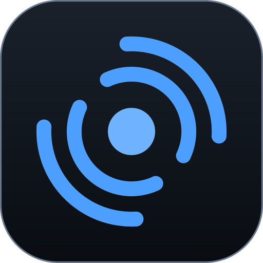
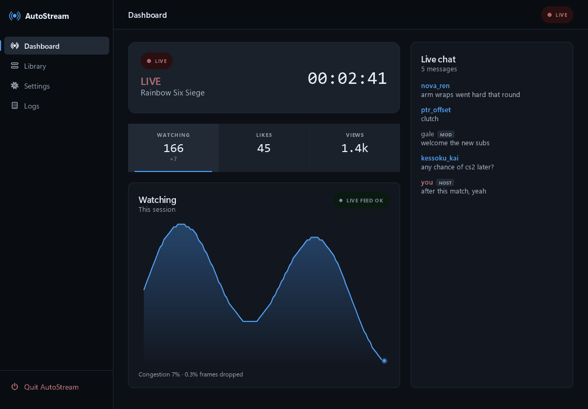
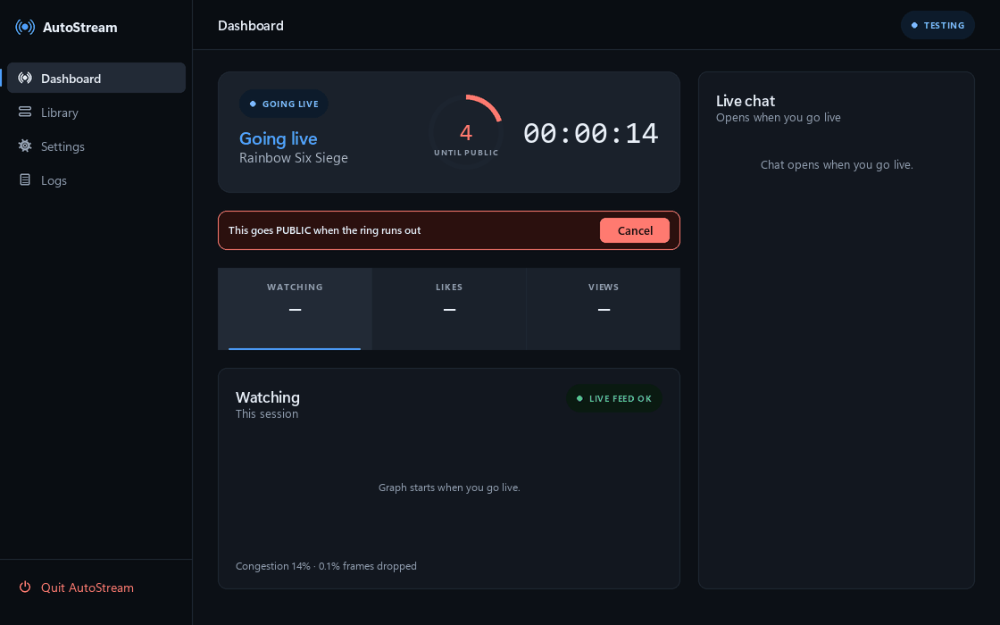

<div align="center">



### <b>AutoStream</b>

**Launch a game. It goes live on YouTube by itself.**

[](https://github.com/hardikneeravsharma/AutoStream/releases/latest)
[](LICENSE)




</div>

AutoStream sits in your Windows system tray and watches which program has focus. The
moment you start a game it recognises, it creates a YouTube broadcast, tells OBS to
start streaming, and titles the stream after the game you are playing. Switch games and
it rewrites the title. Quit the game and it ends the broadcast and tidies up.

It can also record locally while you stream, then find your kills in that recording and
cut them into clips, vertical exports and a montage — without you opening an editor.

You set it up once. After that you never open it again unless you want to.

It talks to exactly three places: **YouTube** (your own channel, through your own Google
Cloud project), **your local OBS**, and two public read-only game-name lists. There is no
server, no account, and no telemetry. Everything it stores stays in its own folder.

## Contents

- [Features](#features)
- [Coming next](#coming-next)
- [What you can use it for](#what-you-can-use-it-for)
- [Nothing goes public by surprise](#nothing-goes-public-by-surprise)
- [The window](#the-window)
- [Before you start](#before-you-start)
- [Install](#install-the-easy-way)
- [Your first week](#your-first-week)
- [Install from source](#install-from-source)
- [How it works](#how-it-works)
- [Troubleshooting](#troubleshooting)
- [Licence](#licence)

## Features

- **Detects the game by itself.** Watches the foreground window and running processes,
  and resolves the `.exe` to a real game name.
  - A public index of ~10,000 titles, plus your own Steam library.
  - No list to maintain. Games it gets wrong are one line in `games.yaml`.
- **Starts and stops the broadcast.** Creates the YouTube broadcast over the API, binds
  it to a permanent stream key, and pushes that key into OBS over websocket.
  - You never touch OBS stream settings.
  - Close the game and it ends the broadcast after a cooldown.
  - If it crashes mid-stream, it sweeps the orphaned broadcast on next start.
- **Writes the title** from a template you control, e.g.
  `{game} — {hook} | {day} night stream`.
- **Handles switching games** mid-session — retitle the same broadcast, or start a fresh
  one, your choice.
- **Records locally while streaming**, in HQ with three separate audio tracks so the
  mic, the game and the desktop stay separable in an editor.
- **Finds your kills in the recording and cuts clips**, with no editing.
  - 16:9 masters, 1080x1920 verticals for Shorts, and a montage with transitions.
  - Filenames say what is in them: `Delta-Force_01_3kills_12m48s_15s.mp4`.
  - Captions and channel branding burned onto the vertical exports.
- **Four ways of finding kills**, because not every game draws a kill marker.
  - Games that do — Delta Force draws a skull under the crosshair — are template
    matched.
  - Counter-Strike 2 draws no kill confirmation at all, so its kill feed is read
    instead, and your own name in it tells a kill from a death from an assist.
  - Valorant needs neither. It draws a yellow border round your own half of a feed
    row, so the colours are read directly — no OCR, no Tesseract, nothing to set up.
  - Counter-Strike also draws a card tally of your kills this round, which can be
    read the same way — no OCR, no in-game name, and assists cannot leak in.
- **Reads the Counter-Strike demo when you have one.** Valve's own `.dem` gives
  exact kills, deaths and rounds — plus kills *through smoke* and *while flashed*,
  which no amount of looking at the screen can tell you. It finds the right demo
  itself and works out which player is you.
- **Clips Counter-Strike by the round, not by the kill**, and takes the rounds from
  the demo when there is one.
  - Aces, 1vN clutches won *and* nearly won, multi-kill rounds, last-one-alive,
    quick multi-kills and chaotic rounds.
  - From the demo, also: the round that broke a losing streak, match point, pistol
    rounds, and kills through smoke, through walls or without a scope.
  - Who was alive on each side is *counted*, not guessed, so a 1v3 is really a 1v3 —
    and a 1v3 won with a single kill outranks an ordinary double, which is the
    whole point.
  - Without a demo it still works, off the scoreboard, exactly as before.
- **Says what the clip is.** An optional spoken hook over the opening seconds —
  "one versus three", "match point" — from **Kokoro-82M** running locally on the
  CPU. The game audio ducks under it and comes straight back. A clip with nothing
  worth saying stays quiet.
- **Cuts a reel to your own music.** Beats found without librosa; the cuts land on
  them, the acts change on phrase boundaries, and the best moment of the session
  lands on the drop — with the clips still in the order they happened.
- **Or don't stream at all.** Turn *Go live on YouTube* off and AutoStream is just
  the clipper: it still spots the game, records it and cuts the clips, never touches
  the YouTube API, and asks for no Google sign-in. The dashboard says RECORDING
  instead of LIVE and drops the things a broadcast would have.
- **Plays your screen savers** at the three moments the game is not the thing to
  look at: *stream starting*, *be right back*, and *thanks for watching*. Point each
  at a video file **or an overlay URL** and AutoStream **creates the OBS scenes
  itself** — a media source for a file, a browser source for a page. There is
  nothing to set up in OBS.
  - Using StreamElements? Paste your channel token once and AutoStream lists your
    overlays and fills the three in for you.
  - Pause keeps the broadcast running and puts the be-right-back card up, so you
    keep the URL, the chat and the people watching.
- **Generates a thumbnail** for each go-live from a live OBS frame, your logo and the
  game — or **assign a finished image per game**, used exactly as given with nothing
  drawn over it.
- **Five themes**, a full settings page, and a log that says why it decided *not* to
  stream.

## Coming next

See [docs/PROGRESS.md](docs/PROGRESS.md) for what has been measured so far and
why each choice was made. The three items that used to be listed here — rounds
from the demo, spoken hooks, and montages that tell the story — are done.

**Valorant round context.** Valorant can label a triple kill but not a 1v3,
because it cannot yet see who is alive. The information is in the feed — every
row is coloured by both players' teams, so each one says which side lost
somebody — but reading it reliably is still to do.

**A faster demo sync.** Finding the demo inside a recording needs only a handful
of detected kills, but the confidence test is a share of *all* of them, so the
whole recording still gets scanned. Making that test window-aware would take a
Counter-Strike clip job from about four minutes to under one.

## What you can use it for

- Streaming every evening without remembering to press anything.
- Never streaming your desktop by accident, because it only goes live on a game it
  recognises and only through a Game Capture scene.
- Turning a three-hour session into a folder of Shorts while you make dinner.
- Finding the two rounds worth watching out of ninety, without scrubbing the VOD.
- Keeping a local HQ recording of every stream, with the mic on its own track, whether
  or not you ever clip it.

## Nothing goes public by surprise



Every broadcast is held **private** behind a visible countdown first, with a Cancel
button. That window is the whole point — see
[Safety rails](#safety-rails-all-on-by-default) for the rest.

## The window

Closing the window does not quit — it keeps running in the tray so it can detect games.

- **Dashboard** — live status, the countdown ring, viewers/likes/views with a live
  graph, OBS ingest health, and live chat.
- **Library** — every game it found. *Open + stream* launches one and goes live
  deliberately.
- **Clips** — every stream you have recorded. Pick one, choose what counts as a
  highlight, and it cuts them.
- **Settings** — every option as a real control, grouped, in plain language.
- **Logs** — what it did, and more usefully why it decided *not* to stream.

---

## Before you start

You need three things. The first one can take a day, so start it now:

1. **A YouTube channel with live streaming enabled.**
   youtube.com → Create → Go live. On a brand-new channel this can take **up to 24
   hours** to activate. Nothing else will work until it does.
2. **OBS Studio** — [obsproject.com](https://obsproject.com)
3. **A free Google Cloud project.** The setup wizard walks you through creating it.
   This is what gives you your own YouTube API allowance rather than sharing one.

In OBS, before you begin: **Tools → WebSocket Server Settings** → tick **Enable
WebSocket server**, leave the port at **4455**, set a password, then click **Apply**
and **OK**. OBS does not open the port until that dialog is committed.

---

## Install (the easy way)

**[⬇ Download the latest release](https://github.com/hardikneeravsharma/AutoStream/releases/latest)**

1. Download `AutoStream-share.zip` and unzip it somewhere permanent, e.g.
   `C:\AutoStream`. Do not run it from inside the zip.
2. Double-click **`AutoStream.exe`**.
   Windows SmartScreen will warn you because the app is not code-signed —
   **More info → Run anyway**.
3. A setup wizard opens. It takes about ten minutes, most of it waiting on Google.

No Python needed. The zip contains no accounts or keys; you connect your own channel
during setup.

### Two things people get wrong

> **Publish your OAuth consent screen.**
> Google Auth Platform → **Audience** → **Publish App**. If you leave it in *Testing*,
> your login silently expires after about 7 days and streaming stops with an
> `invalid_grant` error. You do **not** need Google's verification review.

> **"Google hasn't verified this app" is expected.**
> It is your own personal app. Click **Advanced → Go to … (unsafe)**.

### Start it automatically at login

Finish the wizard first, then open PowerShell **as Administrator** and run:

```powershell
powershell -ExecutionPolicy Bypass -File "C:\AutoStream\Run-At-Startup.ps1"
```

It registers a Scheduled Task that starts AutoStream 45 seconds after every login,
then starts it immediately and confirms it is actually running. Add `-Remove` to undo.

Administrator is needed only to *register* the task. AutoStream itself runs as you —
it has to, because a service cannot see your desktop, your games, or OBS.

---

## Your first week

Leave **privacy on `unlisted`** (the default) until you trust it. Watch a few
sessions, confirm it detects your games correctly, then switch to public in
**Settings → Stream**.

> **Use a Game Capture scene in OBS, never Display Capture.**
> If detection is ever wrong, viewers see a black screen instead of your desktop,
> your email, or whatever else is on your monitor.

### Safety rails, all on by default

| Rail | What it does |
|---|---|
| **Cancel window** | 20 seconds held privately before anything goes public, with a desktop notification and a Cancel button on the dashboard. |
| **Kill switch** | `Ctrl+Alt+Shift+K` pauses everything and stops the stream, from inside any game. |
| **`NOSTREAM` file** | Create an empty file called `NOSTREAM` next to the exe and nothing will ever auto-start. Delete it to re-enable. |
| **Arm delay** | A game must stay open 30 seconds before anything happens, so alt-tabbing never triggers a stream. |
| **Quiet hours** | Optional window where it never auto-starts. Off by default; set it in Settings → Safety. |
| **Veto list** | If a password manager or banking app is running, the entire session is vetoed and nothing streams. |
| **Battery / disk / quota** | Won't start on battery, with under 25 GB free, or when your API quota is nearly spent. |

---

## Install from source

For development, or if you would rather not run a downloaded binary.

Requires **Python 3.12+** and Git.

```powershell
git clone https://github.com/hardikneeravsharma/AutoStream.git
cd AutoStream
powershell -ExecutionPolicy Bypass -File scripts\install.ps1
```

That creates `.venv` and installs dependencies. Then run it — with no config present
it opens the same setup wizard:

```powershell
.\.venv\Scripts\python.exe -m autostream run
```

`config/config.yaml` is **not** tracked by git — it holds your OBS password, YouTube
stream key and local web token. You do not need to create it; the wizard writes it.
[`config/config.example.yaml`](config/config.example.yaml) documents every key.

### Recommended bring-up

Rather than going straight to `run`:

```powershell
# 1. Detection only. No API, no OBS, no streaming. Run it for an evening.
.\.venv\Scripts\python.exe -m autostream detect

# 2. Prove OBS -> YouTube works, on a private broadcast.
.\.venv\Scripts\python.exe -m autostream obs-test

# 3. The real thing.
.\.venv\Scripts\python.exe -m autostream run
```

`detect` prints every unrecognised `.exe` it saw for 60s+ when you Ctrl-C it. Sorting
those into `games:` and `blocklist:` in `config\games.yaml` is the highest-value
30 minutes you can spend — it is what makes detection feel reliable rather than random.

### Build the .exe

```powershell
powershell -ExecutionPolicy Bypass -File scripts\build.ps1          # -> dist\AutoStream\
powershell -ExecutionPolicy Bypass -File scripts\build.ps1 -Dist    # -> shareable zip, no credentials
powershell -ExecutionPolicy Bypass -File scripts\make_shortcut.ps1  # Desktop + Start Menu
```

`-Dist` strips every credential and verifies the archive entry by entry before writing
it. That check exists because `Compress-Archive` reports a per-file failure and then
carries on — Defender briefly locks `base_library.zip` right after PyInstaller writes it,
and a zip missing that one file produces an exe that will not start. Zipping is done by
[`make_zip.py`](scripts/make_zip.py), which retries past the lock and then verifies.

The app icon is generated, not hand-drawn — [`make_icon.py`](scripts/make_icon.py) reads
the same mark and palette token the UI uses, so the two can never drift apart. Rerun it
if you change the accent colour; do not edit the `.ico` by hand:

```powershell
.venv\Scripts\python scripts\make_icon.py       # -> autostream\ui\assets\autostream.ico
```

It writes nine sizes in three tiers. A single bitmap scaled down is what makes small
icons mush: at 16px the mark's 2.2-unit ring stroke is under one pixel, so the smallest
tier drops the outer ring and uses its own bolder proportions.

### Commands

Global flags `-v/--verbose` and `-q/--quiet` work before or after the subcommand.

| Command | What it does |
|---|---|
| `run` | The daemon: window, tray, engine. |
| `setup` | Console setup wizard (the windowed one is easier). |
| `detect` | Detection only — no API, no OBS, no streaming. |
| `obs-test` | 30-second private test stream end to end. |
| `status` | Print current phase, broadcast URL and quota spend as JSON. |
| `stop` | Force-stop whatever is live right now. |
| `scan` | Re-scan for installed games and apps. |
| `auth` | Re-run the Google login if the token ever breaks. |
| `refresh` | Force a game-index refresh. |
| `voice` | Check the spoken-hook voice, `--download` it, `--list-voices`, `--sample` them all, or `--say` a line to a wav. |

---

## How it works

Full technical reference: **[docs/ARCHITECTURE.md](docs/ARCHITECTURE.md)**

### Themes


Every colour in the app resolves through one token contract in
[`theme.py`](autostream/theme.py), so a theme is a palette definition and nothing
else — no view needs to know a theme exists.

### The state machine

Everything is driven by one loop in [`engine.py`](autostream/engine.py), ticking every
3 seconds. It is the only place a broadcast is ever started, retitled or stopped.

```
IDLE ──▶ ARMING ──▶ STARTING ──▶ TESTING ──▶ LIVE ──▶ COOLDOWN ──▶ STOPPING ──▶ IDLE
  │         │                       │                    │
  │         │                       │                    └─ game switch: retitle, or
  │         │                       │                       start a fresh broadcast
  │         │                       └─ the cancel window: private, and
  │         │                          abortable, before it goes public
  │         └─ the game must survive 30s here, so alt-tab never triggers a stream
  └─ preflight: paused? quiet hours? on battery? disk? quota? veto list?
```

State is written to `state.json` **before** each side effect, so a crash mid-transition
is always recoverable — on next start it sweeps any orphaned broadcast.

### Recording and clips

Turned **off** by default, because it costs disk. Switch it on in **Settings → Recording**.

**Why record at all when YouTube already keeps a VOD?** Because that VOD is a copy of a
copy. OBS sends 1080p60 at 10 Mbps, YouTube re-encodes it to roughly 4.5, and Studio
hands back a 720p transcode of *that*. Every clip cut from it starts two lossy
generations down. Recording writes the same picture straight to disk while you stream,
which costs no game framerate on a GPU with a dedicated encoder.

Budget roughly **20–30 GB per hour** at Indistinguishable quality. **AutoStream never
deletes a recording.** Below `record.min_free_gb` it declines to record and streams
anyway rather than making room for itself.

One helper configures OBS for this, and verifies it rather than assuming:

```powershell
.venv\Scripts\python scripts\configure_recording.py            # apply
.venv\Scripts\python scripts\configure_recording.py --dry-run  # just look
.venv\Scripts\python scripts\configure_recording.py --revert   # undo
```

It sets recording to NVENC at CQP ~16, points it at `Videos\AutoStream`, and splits the
audio into **three tracks — 1 the mix, 2 your mic alone, 3 game and Discord alone** — so
a mic that was too quiet can be fixed afterwards in an editor instead of being baked in.
Then it records for five seconds and runs `ffprobe` over the result to prove the tracks
actually landed.

**Finding the kills.** Most shooters confirm your own kill with a fixed glyph on the HUD
— Delta Force draws a skull under the crosshair. That is much better to detect than the
kill feed, which lists everyone's kills and needs OCR plus fuzzy name matching to work
out whose. AutoStream template-matches the glyph instead. On a two-hour session that is
a 60-second scan and it found 219 kills.

Delta Force ships calibrated. Any other game takes about a minute: **Clips → Calibrate a
game**, scrub to a frame just after a kill, drag a box round the marker. It then measures
whether that patch actually stands out from the rest of the recording and tells you, and
refuses to save a template that would match everything.

**Games with no marker at all.** Counter-Strike 2 draws no kill confirmation — no
hitmarker, no banner — and announces kills only in the feed. For those, pick **Only in
the kill feed** when calibrating, drag the box round the whole feed, and give your
in-game name exactly as it appears there. AutoStream then reads the feed and works out
which slot your name is in. **The killer is named first:**

```
YUVANETA           [rifle]  ANSHU      <- nothing to your left: your kill
YUVANETA + Rico    [rifle]  ANSHU      <- still your kill; Rico assisted you
Rico + YUVANETA    [rifle]  ANSHU      <- Rico killed; you only assisted
wAcKyPrAnKsTeR     [rifle]  YUVANETA   <- your name last: you died
```

Assists are detected and deliberately **not** clipped, so "3 kills" in a filename means
three. Reading the feed is slower than matching a glyph — roughly a minute per ten
minutes of footage — and it needs Tesseract:

```powershell
winget install --id UB-Mannheim.TesseractOCR
pip install pytesseract
```

CS2 ships with the feed area already set; you only have to supply your name.

**Counter-Strike can also be read without OCR.** Under the crosshair the game keeps
a tally of your kills *this round* as a fan of cards, one per kill, with the count on
the front card. It resets every round and is absent at zero. Reading that instead of
the feed needs no Tesseract and no in-game name, and assists cannot leak in because
the tally only ever counts your own kills:

```
        1 card  =  34 px wide          width = 18 + 16 x kills, exactly
        2 cards =  50 px
        3 cards =  66 px
```

Two details make it work. A kill makes the tally *flash* — it scales up for about
0.9s — so the flash says **when** and the settled width says **how many**, and the two
check each other. And while you are dead you watch a team-mate, whose tally is not
yours; that is detected from the spectator panel, which also gives your deaths for
free. Your HUD colour is a Counter-Strike setting, so it is measured off your own
recording rather than assumed, and cached after the first scan.

**Best of all, give it the demo.** Counter-Strike hands you the match back as a
`.dem` file — Watch → Your Matches → Download. That is the server's own record, so it
is exact, and it carries things no detector can infer:

```
thrusmoke      the kill went through smoke
attackerblind  you were flashed when you got it
assistedflash  someone flashed for you
penetrated     wallbang        headshot / noscope / distance
winner, reason why each round ended
```

Point AutoStream at your replays folder and it finds the right demo itself — the map
comes out of the header without parsing — then works out which player is you from the
kills alone, so there is nothing to configure here either.

The one hard part is lining the demo up with your recording: demo time is the game
clock, your video is wall clock from whenever OBS started. AutoStream matches them on
the *pattern* of kills rather than anchoring on one event, which survives a missed
detection and handles OBS being started mid-match. **If fewer than 60% of the demo's
kills line up it refuses**, because a wrong offset does not fail loudly — it quietly
mis-cuts every clip in the match.

On a real match that came out at `offset +166.60s, 12 of 12 kills aligned, worst
error 0.01s` — and cutting from those timings needs no scan of the video at all, so
re-cutting the same session at a different length is instant.

Once a demo lines up it also **marks the detector's homework**, which is otherwise
impossible: it says how many kills were found, how many were missed, and how many
were invented. Only kills inside the demo's own span are counted, because a
recording routinely holds a second match the demo knows nothing about.

It needs one package:

```powershell
pip install demoparser2
```

**Valorant needs no name and no OCR at all.** Reading it the way CS2 is read does not
work: Tesseract manages the player's own name in **13-16%** of the frames its row is
actually on screen, and upscaling, autocontrast, sharpening, channel lifts and inversion
were each measured over 176 frames around known-good rows without moving that. A
detector resting on it would miss most kills *silently*, which is indistinguishable from
a quiet recording.

What Valorant does draw is a bright yellow border around **your own** half of a feed
row, at full opacity in a fixed colour. Which end it is on is the whole answer:

```
[you] YuvaNeta  [rifle]  Omen            <- yellow at the LEFT: your kill
      HeMaN     [rifle]  YuvaNeta [you]  <- yellow at the RIGHT: you died
 [you]  Xorro Gaming YT [rifle] HeMaN    <- yellow DETACHED: you only assisted
```

So the bars are read instead of the text. There is nothing to configure, Tesseract is
not needed, and the scan runs at about **20x real time** — a 46-minute recording in
under two and a half minutes, against roughly 3.5x for the OCR path.

Assists are the case worth getting right: your portrait appears on rows you only
assisted, but as a separate tile sitting clear of the bar, while on your own kill it
touches your name. Killing yourself puts you at both ends, and is counted as a death.

Measured on one 46-minute 1080p recording, every one of the **23 kills it reported was
checked against the footage and all 23 were real**. Deaths and assists are detected too
but are not clipped, and have not been audited that thoroughly. The feed regions were
measured at one person's HUD scale; a different scale needs recalibrating from the Clips
page. Valorant is clipped by kill bursts, not by round — the round layer is CS2 only.

**Counter-Strike is clipped by the round, not by the kill.** Kills are the wrong unit
there: three kills with the team alive is a good start, three kills alone against three
is the clip people watch, and ranking by kill count buries the second one. A 1v3 won
with a single kill produces *one* kill and would be cut as a four-second single.

So for CS2 the scoreboard is read as well as the feed, from the same pass over the
recording:

```
             1:14          <- round timer
           12 | 12         <- score, which is how rounds are found
            3 |  2         <- players alive, which is how a clutch is found
```

Rounds are split on the score changing rather than the timer resetting, because the
score also says who won and it survives overtime. The half-time side swap is detected
explicitly — miss it and every win in the second half is recorded as a loss.

**With a demo, none of that has to be inferred.** The same rounds are built from
Valve's own record instead: `round_start` and `round_end` for the boundaries, the
winner straight off each round, and the roster read at every round's freeze end —
the one moment everybody is alive and on the side they will play it on. The
half-time swap stops being something to detect, because the roster is simply read
again next round.

That makes the alive counts a countdown from the roster rather than two OCR'd
digits, so **1vN is counted**. It also showed up a rule that was missing: a round
came out labelled `ALMOST 1v4` in which the player did nothing at all and then
died. A lost last stand now needs a kill in it. The scoreboard path could never
have surfaced that, because it needed kills to infer the counts in the first place.

Each round is then labelled, and one clip is cut per round carrying every label it
earned, named by the strongest:

| Label | What it means |
|---|---|
| `ACE` | five kills in the round |
| `CLUTCH 1vN` | last one alive against N, and you won |
| `ALMOST 1vN` | the same, and you did not — often the better watch, so it is kept |
| `4 KILLS` | four-kill round |
| `LAST ALIVE` | last one alive against one |
| `3K IN 5s` | three kills inside five seconds |
| `CHAOS` | a fast round with a high death rate on both sides |
| `SURVIVED THE LOSS` | you got a kill and lived, and the round was still lost |

With a demo, also — none of these are visible on screen:

| Label | What it means |
|---|---|
| `THROUGH SMOKE` | you shot through a smoke and hit |
| `WALLBANG` | the bullet went through something first |
| `NO SCOPE` | sniper, no scope |
| `KNIFE KILL`, `ZEUS`, `NADE KILL` | by the weapon the demo names |
| `BLIND KILL` | you were flashed when you got it |
| `STREAK BREAKER` | the win that ended three or more losses in a row |
| `MATCH POINT` | the round that could win the match |
| `PISTOL ROUND` | round one of either half, with two kills or more |

These are labelled because they are *rare*. Over one whole match: 4 kills through
smoke and 2 wallbangs in 115 — against 48 headshots, which is why a headshot is not
a label.

Pick which of those you want on the Clips page. **Keep the whole round** gives you all
30–115 seconds of it; turning it off trims to a Shorts-length cut that keeps the
*ending*, because in Counter-Strike the resolution is the payoff.

The scoreboard also acts as a check on the kill feed: the enemy team can only lose five
players, so a round the feed calls a six-kill ace is corrected rather than published.

**Counter-Strike clips get more room at both ends than the others.** Short-form's
1.5 seconds of run-up and 2 of tail are right for a respawn shooter, where the kill
*is* the moment — and they made CS2 clips come out four seconds long. Two things are
different here: the feed row naming your kill stays up for a median of five seconds,
so a two-second tail cuts while the game is still announcing it, and there is no
respawn, so a kill is the end of a slow approach that 1.5 seconds does not show. Its
profile therefore sets a floor of 3 seconds in and 4 out. Floors only: if you pick
**Full context**, you still get its 6.

**Spoken hooks.** Optional, off by default. Each vertical clip can open with a line
that gives someone a reason to stay — not a description of what they are about to
watch:

```
a 1v2 clutch      "they had the numbers. I had the timing."
a kill in smoke   "couldn't see a thing. didn't need to."
the round that
broke a losing
streak            "this is where it finally turned."
```

Spoken by **Kokoro-82M** on the CPU, with the game audio ducked underneath and back
to normal the moment it finishes, and written out as a subtitle under the picture
that fades once the line has been said. What happened in the round picks the pool;
where the clip sits in the recording picks the line, so a re-cut says the same thing
and two clutches in one session do not. A clip with nothing worth saying stays silent
rather than being given filler. It lands in the run-up, which is the one part of a
clip where nothing has happened yet.

The voice is a setting, because it is the one thing here that cannot be decided by
measurement. 28 English voices ship in the model — American and British, male and
female — and the fastest way to choose is to hear them all say the same line:

```powershell
python -m autostream voice --list-voices
python -m autostream voice --sample     # one wav per voice, in models\kokoro\samples
```

Then set `clips.voice_name`. The default is `am_michael`.

The voice is a one-off 177 MB download:

```powershell
pip install kokoro-onnx
python -m autostream voice --download
python -m autostream voice --say "One versus three."   # try it
```

**A reel, if you supply a track.** Set `clips.music` to a file you own and the
montage is joined by a beat-synced cut as well: cuts on the beat, act changes on
phrase boundaries, and the best moment of the session on the drop. The clips stay in
the order they happened — the *music* is offset so the drop lands on the peak, rather
than the peak being moved to the middle of the reel:

```
opening    8 beats     the pistol round, or first blood
the slide  4 -> 2      compressed, and a round you LOST gets half the room
THE TURN   16 beats    the peak -- its LAST kill lands exactly on the drop
the push   4 -> 2      flash cuts
match point 8 beats    so the reel lands instead of stopping
```

The last kill, not the first: a clutch is won by its last one, and anchoring on
the first put the drop on the defuse afterwards. The kill lands a tenth of a
second *before* the drop, never after — a beat arriving just after the kill
reads as the music answering it, and just before reads as a mistake. A track
usually has several arrivals, and the reel aims at the biggest one it can
*reach*: there has to be enough music in front of it to hold the build-up, and
deleting clips to make the music fit is the wrong way round.

Longer slots put their kill on a beat as well as their cut — a slot always
starts on a beat, so rounding the run-up to whole beats lands both. Not every
slot: landing everything on the grid is mechanical, and the short flash cuts
keep a natural lead.

`clips.order` picks between three arrangements: `story` (chronological, the
default), `build` (weakest to strongest) and `hook` (best moment first, which is
where a Short is won).

**The kills that did not earn a clip become the advert.** Anything below your
minimum is not cut on its own — a lone kill has nothing a caption could honestly
claim about the play. Instead they are trimmed to a few seconds each, run
together into one vertical reel and captioned with a claim that *is* honest,
because it is about the channel rather than the play:

```
LIVE MOST EVENINGS 🎮
                              ... seven leftover kills, ~5s each
@YuvaNeta
```

Set the line with `clips.promo_caption`, or turn the whole thing off with
`clips.promo`.

**What comes out**, in `clips/<date>_<time>_<Game>/`:

```
clips/     Delta-Force_01_5kills_12m48s_30s.mp4      <- the editing copies
vertical/  Delta-Force_01_5kills_12m48s_30s_vertical.mp4
montage/   Delta-Force_2026-08-19_montage_12clips_47kills_5m12s.mp4
montage/   Delta-Force_reel.mp4                      <- only if you gave it music
promo/     Delta-Force_promo_7clips_32s.mp4          <- the leftovers, as an advert
session.json  clips.json                             <- what was found, and cut
```

Filenames repeat the game on purpose: clips get dragged into editors and uploaded, and
the folder they came from is lost the moment they are.

`Minimum kills per clip` counts kills **inside the finished clip**, not inside the fight
it came from — a five-kill fight spread over ninety seconds does not become a five-kill
twenty-second clip. Longer clips therefore find more of them:

| Minimum | 20s clips | Whole moment |
|---|---|---|
| 1+ | 88 clips, 70% of kills | 88 clips, 100% |
| 2+ | 39 clips, 47% | 45 clips, 80% |
| 3+ | 20 clips, 30% | 26 clips, 63% |

*(measured on one real two-hour session with 219 kills)*

Needs **ffmpeg** (`winget install --id Gyan.FFmpeg`) and **numpy**. Without either, the
Clips page shows what is missing and the rest of AutoStream is unaffected.

### Module map

| Module | Responsibility |
|---|---|
| [`engine.py`](autostream/engine.py) | The state machine. The only place streams start or stop. |
| [`watcher.py`](autostream/watcher.py) | Foreground window + process polling. No network. |
| [`gameindex.py`](autostream/gameindex.py) | exe → game name, from your overrides + public indexes. |
| [`obs.py`](autostream/obs.py) | obs-websocket v5 client. |
| [`youtube.py`](autostream/youtube.py) | YouTube Data API v3: OAuth, broadcasts, chat, quota. |
| [`schema.py`](autostream/schema.py) | One declarative source of truth for all 84 settings — drives both the settings form and server-side validation. |
| [`history.py`](autostream/history.py) | Append-only journal of finished sessions. The only record of which game ran on which broadcast. |
| [`clips/`](autostream/clips/) | Optional. `detect` finds kill markers, `plan` decides what to cut, `cutter` and `montage` produce the files, `jobs` runs it off the engine thread, `calibrate` teaches it a new game. |
| [`clips/valorant_feed.py`](autostream/clips/valorant_feed.py) | Valorant kills from the feed's coloured bars. No OCR, no in-game name. |
| [`clips/cs2_cards.py`](autostream/clips/cs2_cards.py) | Counter-Strike kills from the round card tally. No OCR; the HUD colour is measured, not asked for. |
| [`clips/cs2_demo.py`](autostream/clips/cs2_demo.py) | Counter-Strike `.dem` parsing, and the fingerprint sync that maps demo time onto your recording. |
| [`clips/beatsync.py`](autostream/clips/beatsync.py) | Tempo, beat phase and the drop, from an onset envelope — no librosa. |
| [`clips/story.py`](autostream/clips/story.py) | The arc: opening, the slide, the turn, the push, match point. Clips stay in order and the music is offset so the drop lands on the peak. |
| [`clips/voice.py`](autostream/clips/voice.py) | Spoken hooks from Kokoro-82M, ducked over the run-up. Optional download; silent without it. |
| [`webui.py`](autostream/webui.py) | Local HTTP server and JSON API. |
| [`ui/`](autostream/ui/) | The five-page web app: `shell`, `dashboard`, `library`, `clips`, `settings`, `logs`, `setup`. |
| [`window.py`](autostream/window.py) | Native window via pywebview (Edge WebView2). |
| [`cfg.py`](autostream/cfg.py) | Config load/merge with defaults, atomic writes. |

### Threading

pywebview must own the main thread, so everything else runs beside it:

```
main    pywebview native window
worker  engine poll loop      <- the only thread with side effects
worker  HTTP server (web UI)
worker  tray icon
worker  overlay panel
worker  clip job              <- only while cutting clips
```

The UI never touches OBS or YouTube directly. It posts commands onto a queue that the
engine thread drains, which is what keeps "two clicks at once" from racing.

A clip job gets its own thread for the same reason inverted: the engine loop is strictly
serial, so a multi-minute ffmpeg pass parked in it would freeze phase transitions and the
OBS watchdog for the duration. It reports progress into the status payload the dashboard
already polls, which is also why progress survives closing and reopening the page.

### Files it writes

```
config/config.yaml         your settings (not in git — contains secrets)
config/games.yaml          exe -> name overrides, blocklist, veto list
config/apps.yaml           the launcher's app list
config/index.cache.json    downloaded game index
config/clip_profiles.yaml  kill-marker profiles you calibrated
config/clip_templates/     the marker images themselves
secrets/client_secret.json Google Cloud credentials
secrets/token.json         your YouTube login — never share this
state.json                 current phase and broadcast id (crash recovery)
logs/autostream.log        rotating, 7 days
```

Video and its metadata live **outside** the application folder, in
`Videos\AutoStream` (override with `AUTOSTREAM_VIDEO_HOME`):

```
Videos\AutoStream    2026-08-19 05-15-45.mp4    the recordings themselves
    history.jsonl              one line per finished stream — what the Clips page reads
    clips\<date>_<time>_<Game>\   finished clips, one folder per stream
```

They are kept out of the app folder deliberately. A frozen build lives in
`dist\AutoStream`, and **PyInstaller deletes that entire directory on every rebuild** —
so anything stored there is destroyed by a routine `build.ps1` run. Recordings, clips and
the session journal all outlive any particular installation, so none of them belong
inside it.

---

## Troubleshooting

| Symptom | Fix |
|---|---|
| **The stream is a black screen** | Almost always kernel anti-cheat refusing OBS's Game Capture hook — Delta Force, Valorant, anything with EasyAntiCheat. **Run OBS as administrator.** The failure is silent and total: the capture stays black while streaming, recording and ingest health all report perfectly fine. Turn on **Start OBS as administrator** in Settings → OBS, and tick *Run this program as an administrator* under the exe's Compatibility tab so it applies however OBS is started. |
| **It goes live before the game is up, then flaps to Cooldown** | The game has a small launcher stub that starts the real binary and exits. Arm on the stub and you broadcast a black screen until the game loads. Add the stub to `blocklist:` in `config\games.yaml` — for Delta Force that is `deltaforceclient.exe`, leaving `deltaforceclient-win64-shipping.exe` as the game. |
| **Nothing happens when I launch a game** | It is not in the index. Check the **Logs** page to see what was detected, then add the exe under `games:` in `config\games.yaml`. |
| **It started for something that isn't a game** | Add that exe to `blocklist:` in `config\games.yaml`. |
| **A game I own isn't in the Library** | Non-Steam launchers proxy through their own client (Valorant's shortcut points at `RiotClientServices.exe`), and some Steam games hide the real binary several folders deep. Both are handled — hit **Rescan**. If it still misses, add it under `games:` in `config\games.yaml`. |
| **`invalid_grant`, or it stopped working after a week** | The OAuth consent screen is still in *Testing*. Publish it, then re-run setup or `-m autostream auth`. |
| **Can't reach OBS** | Is OBS running? WebSocket enabled? Password right? Did you click **Apply** in that dialog? |
| **Stuck on "Starting", then gives up** | YouTube is not receiving video. Confirm live streaming is actually enabled on the channel (can take 24h), then re-run setup to rewrite the stream key. |
| **Broadcast stuck live after a crash** | Restart it — it sweeps orphans on startup. Or run `-m autostream stop`. |
| **It doesn't start at login** | `Get-ScheduledTaskInfo -TaskName AutoStream`. `0x0` or `0x41301` is healthy; anything else, check `logs\autostream.log`. |
| **It won't start at all** | Read `logs\autostream.log` and `logs\crash.log` next to the exe. |

---

## Licence

[Apache License 2.0](LICENSE) — free to use, modify and distribute, including commercially,
provided you keep the notice and state your changes. Comes with an explicit patent grant and
no warranty.
